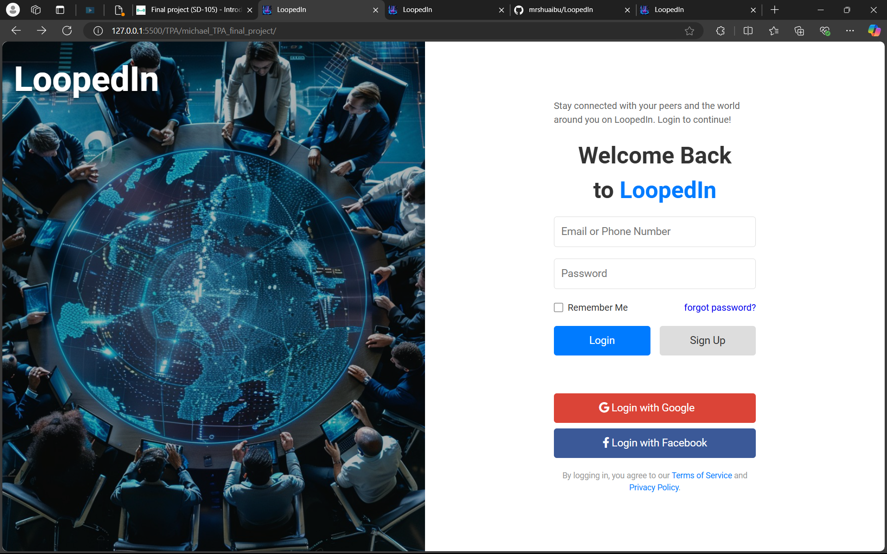
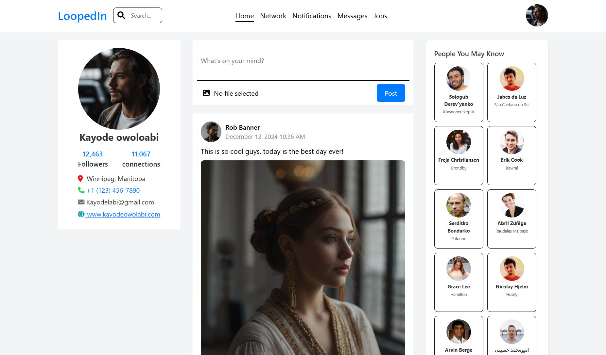

# LoopedIn

LoopedIn is a dynamic and interactive web platform designed to connect individuals globally. It provides a seamless experience for users to engage with peers, access real-time updates, and share content. The website is fully responsive, ensuring smooth navigation across various devices. It employs HTML, CSS, JavaScript, and third-party APIs for various functionalities.

## Description

LoopedIn allows users to log in, sign up, and interact with a social community. The platform provides features such as social login options (Google and Facebook), a user-friendly interface, and a secure login system. Users can engage with peers, post updates, and track their activities. Additionally, LoopedIn offers a sleek and visually appealing layout that adapts to both mobile and desktop devices.

---

## Features

- User Authentication: Secure login and sign-up options.
- Social Media Integration: Login via Google and Facebook.
- User Profile Management: Allows users to update and manage their profile.
- Responsive Design: Optimized for both desktop and mobile views.
- Interactive UI: Engaging, visually appealing interface.
- Real-time Updates: Notifications and real-time content updates.

---

## Login details
To access the platform, use the following credentials:

-  username: meet_michael
- password: password123

---

## Screenshot

---

### Technologies used

